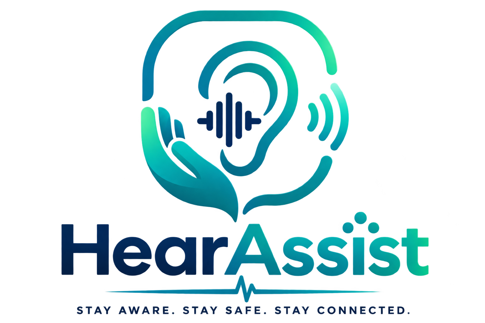
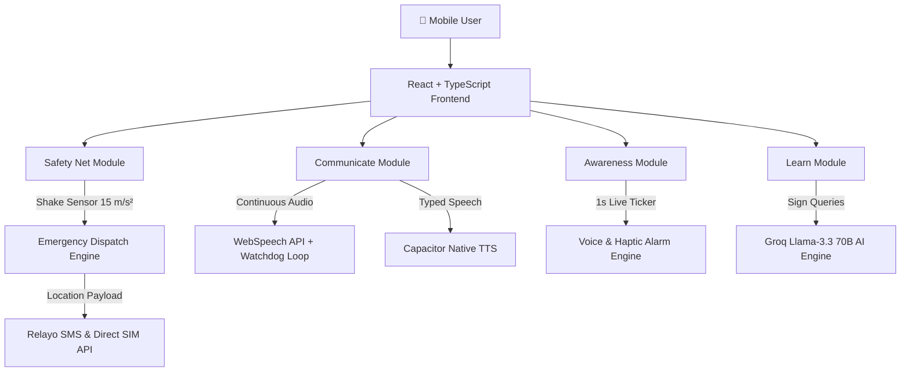

<div align="center">

  

  # 🤟 HearAssist
  ### *Stay Aware. Stay Safe. Stay Connected.*

  **An Assistive Ecosystem for Hearing Impairment & Deaf Accessibility**

  [](https://github.com/srinivas191206/access-)
  [](android/app/build/outputs/apk/debug/app-debug.apk)
  [](https://groq.com/)
  [](https://www.typescriptlang.org/)

  ---

  <p align="center">
    <a href="#-key-features"><b>Features</b></a> •
    <a href="#-architecture-overview"><b>Architecture</b></a> •
    <a href="#-interactive-demo--modules"><b>Interactive Modules</b></a> •
    <a href="#-installation--build"><b>Installation</b></a>
  </p>

</div>

---

## 🌟 Overview

**HearAssist** is a multi-modular assistive mobile app designed to break communication barriers and guarantee safety for people with hearing impairment. Built for **AITAM HackSprint 2.0 Hackathon 2026**, HearAssist combines **Real-Time Sound AI Detection**, **Continuous Live Speech-to-Text (STT)**, **Native Hardware Text-to-Speech (TTS)**, **Automatic Mobile Shake SOS Emergency Dispatch**, and an **AI-Powered Sign Language Learning Hub**.

---

## 🚀 Key Features

| Feature | Description | Status |
| :--- | :--- | :---: |
| 🚨 **Emergency Safety Net** | Accelerometer Shake SOS Trigger (15.0 m/s²) + Live GPS Coordinates SMS Dispatch | `ACTIVE` |
| 🎙️ **Live Conversation STT** | Watchdog-guaranteed WebSpeech API streaming text with 1.2s silence auto-commit | `ACTIVE` |
| 🔊 **Loud Native TTS** | Max Hardware Volume Text-to-Speech for non-verbal users | `ACTIVE` |
| ⏰ **Real-Time Timers** | 1-Second Countdown Ticker + Voice Alarm Announcement (*"Attention! It's time to..."*) | `ACTIVE` |
| 🤖 **HearAssist AI Tutor** | Groq Llama-3.3 70B AI Assistant for ASL & ISL sign explanations | `ACTIVE` |
| 🔋 **Physical Battery Monitor** | Live phone battery percentage and charging state via `navigator.getBattery()` | `ACTIVE` |

---

## 📱 Interactive Modules

<details>
<summary><b>🚨 1. Emergency Safety Net & Mobile Shake SOS (Click to Expand)</b></summary>
<br />

HearAssist monitors physical accelerometer sensors to protect users in critical crises:
- **Phone Shake Trigger**: Shaking the phone past **15.0 m/s²** automatically triggers a 10-second emergency countdown.
- **Relayo & Direct SIM SMS**: Dispatches emergency SMS to contacts containing exact Google Maps location coordinates (`18.5658159, 84.1965129`).
- **Pulsing Radar Hero UI**: Central Red SOS button enclosed by interactive rotating and pulsing radar rings.

</details>

<details>
<summary><b>🎙️ 2. Live Conversation Chat (Speech-to-Text & TTS) (Click to Expand)</b></summary>
<br />

The **Communicate** tab enables continuous, two-way live conversation:
- **1.5s Watchdog Guard**: Automatic liveness loop auto-recovers speech recognition if Android OS tears down the session.
- **Phrase Deduplication**: Automatically cleans repeated words (`deduplicateText`).
- **Loud Speaker TTS**: Speaks typed responses aloud at max volume via Capacitor Text-to-Speech.

</details>

<details>
<summary><b>⏰ 3. Sound Awareness & Real-Time Timers (Click to Expand)</b></summary>
<br />

Never miss a home alarm or cooking timer:
- **1-Second Live Ticker**: Active timers count down in real time (`00:59`, `00:58`, ...).
- **Voice Alarm Announcement**: When time expires, HearAssist vibrates in multi-burst patterns and announces out loud: *"Attention! It's time to Cooking (Oven)!"*.
- **1-Click Quick Presets**: `⏱️ 1 Min Alarm`, `🍳 2 Min Cooking`, `💊 5 Min Medicine`, `⚡ 10 Sec Test`.

</details>

<details>
<summary><b>🎓 4. Learn Hub & HearAssist AI Assistant (Click to Expand)</b></summary>
<br />

An educational suite for mastering sign language:
- **Sign Demonstrations**: GIF sign resources for emergency, daily life, medical, and social terms.
- **Markdown AI Chatbot**: Professional `🤖 HearAssist AI Tutor` powered by Groq Llama-3.3 70B with formatted bold text and quick prompt chips.
- **Flashcards & Quizzes**: Interactive flashcard deck and practice quiz generator.

</details>

---

## 🛠️ Architecture Overview



---

## ⚙️ Installation & Build

### Prerequisites
- **Node.js**: `v18.0+`
- **Android SDK**: Android Studio & Gradle for building native APK.

### 1. Clone & Install Dependencies
```bash
git clone https://github.com/srinivas191206/access-.git
cd access-
npm install
```

### 2. Run Local Development Server
```bash
npm run dev
```

### 3. Build Production Bundle & Sync Capacitor
```bash
npm run build
npx cap sync android
```

### 4. Compile Android Debug APK
```bash
export ANDROID_HOME=$HOME/Library/Android/sdk
cd android && ./gradlew assembleDebug
```

The compiled APK will be output at:
`android/app/build/outputs/apk/debug/app-debug.apk`

---

<div align="center">

  ### 🏆 Built with ❤️ for **AITAM HackSprint 2.0 Hackathon 2026**
  **Team HearAssist** • *Empowering Hearing Impairment Through Innovation*

</div>
